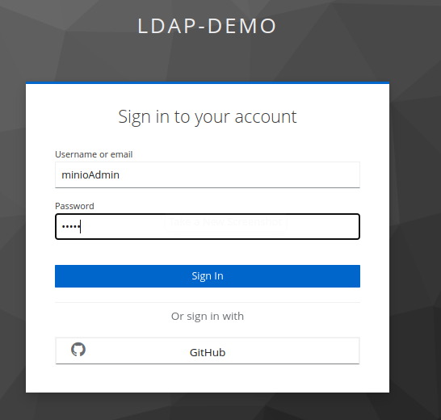

:scrollbar:
:data-uri:
:toc2:
:linkattrs:

= MinIO Integrations Quickstart

:numbered:

== Environment Variables

=== Local (docker-compose)
. For a local (docker-compose) environemnt, set the following environment variables in your shell with values similar to the following:
+
-----
export RHSSO_HOST=sso.local
export RHSSO_URL=http://$RHSSO_HOST:4080
export RHSSO_MASTER_PASSWD=admin
export REALM_ID=ldap-demo
export OAUTH_CLIENT_ID=minio-oauth                              # Used by application clients to the MinIO REST APIs
export OIDC_CLIENT_ID=minio-oidc                                # Used to secure MinIO admin console
export SSO_CLIENT_SECRET=avqeuje9yGOG37H1rbGm8I4qI7ht0ux1
export ACCESS_TOKEN_URL="$RHSSO_URL/realms/$REALM_ID/protocol/openid-connect/token"
export MINIO_ROUTE=http://localhost:9000
-----

. Add the following entry to your `/etc/hosts`:
+
-----
127.0.0.1   sso.local
-----

== Integration with Keycloak

This quickstart demonstrates link:https://github.com/minio/minio/blob/master/docs/sts/keycloak.md[Integration between MinIO and Keycloak].

Specifically, the MinIO admin console is secured using _Authorization Code_ flow of OIDC.
In addition, the MinIO REST APIs are secured using _Client Credentials_ flow of OAuth2.

=== _policy_ claim

The _policy_ claim on each of the OAuth2 access token is utilized for authorization purposes in MinIO.

The value of the _policy_ claim can be viewed as follows:

. Retrieve an OAuth2 _access token_ using OAuth2 Client Credentials flow :
+
-----
TKN=$(curl -X POST "$ACCESS_TOKEN_URL" \
            -H "Content-Type: application/x-www-form-urlencoded" \
            -d "client_id=$OAUTH_CLIENT_ID" \
            -d "client_secret=$SSO_CLIENT_SECRET" \
            -d "grant_type=client_credentials" \
            -d "scope=openid" \
            | sed 's/.*access_token":"//g' | sed 's/".*//g')

$ echo $TKN
-----
+
NOTE:  The value of the _policy_ claim is set as a hard-coded value.

. The value of _policy_ claim can be viewed as follows:
+
-----
$ jq -R 'split(".") | .[1] | @base64d | fromjson' <<< $TKN | jq -r .policy

consoleAdmin
-----

. Alternatively, you can also retrieve an OAuth2 _access token_ using the OAuth2 link:https://tools.ietf.org/html/rfc6749#section-4.3[Resource Owner Password Credentials] flow configured on the client that will be used to secure the MinIO web console:
+
-----
TKN=$(curl -X POST "$ACCESS_TOKEN_URL" \
            -H "Content-Type: application/x-www-form-urlencoded" \
            -d "username=minioAdmin" \
            -d "password=minio" \
            -d "grant_type=password" \
            -d "client_id=$OIDC_CLIENT_ID" \
            -d "client_secret=$SSO_CLIENT_SECRET" \
            -d "scope=openid" \
            | sed 's/.*access_token":"//g' | sed 's/".*//g')

$ echo $TKN
-----
+
NOTE:  The value of the _policy_ claim originates as an attribute on the _minioAdmin_ user.

=== Minio Admin Console

. Login using the following credentials:app-name:
.. *Username*:  minioAdmin
.. *Password*:  minio

=== MinIO REST APIs secured using OAuth2

Via the link:https://min.io/docs/minio/linux/developers/security-token-service/AssumeRoleWithWebIdentity.html[AssumeRoleWithWebIdentity] API of Minio, a temporary access credential can be generated by exchanging for a JSON Web Token (issued by Keycloak).

This access credential can then be used by a client to access the MinIO REST APIs.

==== Command line test

. Retrieve a token from the OAuth2 _client-credentials_ enabled SSO client:
+
-----
TKN=$(curl -X POST "$ACCESS_TOKEN_URL" \
            -H "Content-Type: application/x-www-form-urlencoded" \
            -d "client_id=$OAUTH_CLIENT_ID" \
            -d "client_secret=$SSO_CLIENT_SECRET" \
            -d "grant_type=client_credentials" \
            -d "scope=openid" \
            | sed 's/.*access_token":"//g' | sed 's/".*//g')
-----
+
NOTE: This SSO client (as per $OAUTH_CLIENT_ID) is configured to allow link:https://www.keycloak.org/docs/latest/server_development/#authenticating-with-a-service-account[Authentication with a service account].

. Invoke the MinIO Security Token Service (STS) _AssumeRoleWIthIdentity_ API endpoint to generate a temporary access credential using a JWT:app-name:
+
-----
curl -X POST "$MINIO_ROUTE" \
            -H "Content-Type: application/x-www-form-urlencoded" \
            -d "Action=AssumeRoleWithWebIdentity" \
            -d "WebIdentityToken=$TKN" \
            -d "Version=2011-06-15" \
            -d "DurationSeconds=86000"

<?xml version="1.0" encoding="utf-8"?>
<AssumeRoleWithWebIdentityResponse xmlns="https://sts.amazonaws.com/doc/2011-06-15/">

  <AssumeRoleWithWebIdentityResult>
    <AssumedRoleUser>
      <Arn></Arn>
      <AssumeRoleId></AssumeRoleId>
    </AssumedRoleUser>

    ...
 </AssumeRoleWithWebIdentityResponse>
-----

==== Web App test

. Change directory to _jdk-app_
+
-----
$ cd jdk-app
-----

. Create and populate _.env_ file in root of this project similar to the following:
+
-----
org.acme.minIOendpointUrl=http://127.0.0.1:9000
org.acme.minIObucketName=xxxx
org.acme.minIOobjectPath=/xxx/yyyy/zzz.jpeg
org.acme.minIOobjectTags=type:photo,family:true,year:2022,numPeople:3

# Service account
#org.acme.minIOaccessKey=xxxx
#org.acme.minIOsecretKey=xxxx

# oauth client credentials
org.acme.oauth.idpEndpoint=http://sso.local:4080/realms/ldap-demo/protocol/openid-connect/token
org.acme.oauth.clientId=minio-oauth
org.acme.oauth.clientSecret=xxxxx
-----

. Execute quarkus:dev
+
-----
$ mvn quarkus:dev
-----

. In a different shell, execute:
+
-----
$ curl -X PUT localhost:8080/minio/lifecycle
-----

== TO-DO

. link:https://min.io/docs/minio/linux/administration/object-management/object-versioning.html#minio-bucket-versioning[Versioning]
